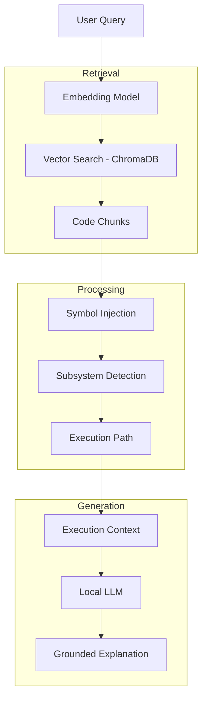

# Kernel Flow Explorer
### Semantic Execution Analysis for the Linux Kernel

⚡ Runs fully locally. No API keys. No cost.

Understand the Linux kernel by **retrieving real code**, **reconstructing execution paths**, and **explaining them using a local LLM**.

Instead of relying on an LLM’s internal knowledge, this system:

- retrieves real kernel code
- reconstructs execution paths
- explains behavior using a local LLM
---

# The Idea

Ask:

```
What happens when a timer interrupt wakes a sleeping task?
```

Get:

```
generic_handle_irq
→ handle_irq_desc
→ handle_irq_event
→ handle_irq_event_percpu
→ hrtimer_interrupt
→ __hrtimer_run_queues
→ run_timer_softirq
→ try_to_wake_up
→ ttwu_queue
→ ttwu_do_activate
→ activate_task
→ enqueue_task
→ check_preempt_curr
```

Which maps to:

```
IRQ → Timer → SoftIRQ → Scheduler Wakeup
```

---

# Why This Project Exists

Large language models can explain the Linux kernel.

But they typically provide:

- high-level summaries
- simplified flows
- answers not grounded in real code

Which means:

> The answer sounds correct, but cannot be verified.

---

## A Different Approach

Instead of:

```
LLM → answer
```

This project does:

```
Query → retrieve code → build execution flow → LLM explains
```

---

## Why Semantic Execution Analysis Matters

The Linux kernel is:

- massive (millions of LOC)
- highly modular
- full of indirection (function pointers, ops tables)
- cross-subsystem by design

This makes it difficult for LLMs alone to reason accurately.

Execution-aware retrieval helps by:

- grounding explanations in real kernel code
- reconstructing subsystem execution paths
- reducing hallucinated reasoning
- enabling inspectable execution flow analysis

---

## What You Gain

- grounded explanations
- visible execution paths
- reproducible reasoning
- faster understanding of unfamiliar subsystems

---

## Current Scope

Kernel Flow Explorer focuses on:

- semantic execution reconstruction
- subsystem-aware tracing
- execution-path understanding
- grounded kernel explanations

The current implementation uses:
- heuristic traversal
- semantic reranking
- dispatch reconstruction

rather than full compiler-grade static analysis.

---

# How It Works



---

# Quick Start

```bash
# Run after completing installation
python linux_code_assistant.py
```

Then ask:

```
How does Linux handle an interrupt?
```

� Full setup guide: **[INSTALLATION.md](./INSTALLATION.md)**

---

# Who This Is For

### Linux Kernel Engineers
- trace execution across subsystems
- explore unfamiliar paths quickly

### Engineers Learning the Kernel
- understand flows without deep prior context
- visualize interactions across components

### Systems / AI Engineers
- see how retrieval + reranking + domain heuristics combine
- learn how semantic retrieval, reranking, and execution reconstruction combine for grounded systems reasoning

### Anyone Wanting a Local AI Tutor
- no API cost
- works offline

---

# Generated Graphs

Each query produces a Mermaid graph:

```
callgraphs/
interrupt/
interrupt_timer_wakeup/
interrupt_wakeup/
```

Graphs include timestamps and execution paths.

---

# Architecture

```
Query
↓
Embedding search (ChromaDB)
↓
Kernel-aware reranking
↓
Symbol injection (ctags)
↓
Subsystem detection
↓
Execution path reconstruction
↓
Mermaid execution graph
↓
Grounded LLM explanation
```

---

# Example Queries

- How does Linux handle an interrupt?
- What happens when a timer interrupt wakes a sleeping task?
- How does the scheduler perform a context switch?
- How does a futex wake a task?

---

# Running on Windows (WSL)

Works well on:

- Windows 10/11
- WSL2 + Ubuntu

Notes:

- run everything inside `/home`
- avoid `/mnt/c` (slow IO for indexing)

---

Current capabilities include:
- scheduler-class dispatch reconstruction
- semantic execution-path tracing
- Mermaid execution graph generation
- persistent semantic graph caching

---

# Current Limitations
- partial function-pointer reconstruction
- arch-specific execution simplifications
- heuristic execution tracing in some subsystems
- no runtime validation yet

---

## Current Semantic Coverage

Implemented:
- scheduler execution tracing
- scheduler-class dispatch reconstruction
- Mermaid execution graph generation
- persistent semantic graph caching

Planned:
- wakeup flows
- IRQ execution tracing
- MM traversal
- driver subsystem reconstruction
- SMP interactions
- cgroup-aware tracing

The current implementation can reconstruct scheduler-class execution dispatch paths, including indirect scheduling transitions such as:

pick_next_task()
→ __pick_next_task()
→ pick_next_task_fair()

---

# Future Work

### Core Kernel Understanding
- function pointer tracing
- real callgraph integration (clang / cflow)
- runtime tracing (ftrace, eBPF)

### Semantic Retrieval & Execution Analysis Improvements
- graph-aware semantic retrieval
- multi-source semantic retrieval (code + docs)
- execution-aware retrieval refinement

### Intelligence Layer
- subsystem-aware reasoning (USB, networking, DRM, block layer)

### Developer Experience
- session history & exploration
- better visualization (layered diagrams, subsystem boundaries)

### Platform & Model
- native Windows support
- auto-select best local LLM (optional)
- plug-and-play model layer


---

# Long Term Direction

This is not just about the Linux kernel.

The same approach can be applied to:

- large codebases
- textbooks
- engineering systems

The goal:

> Turn complex systems into something you can ask questions to and understand deeply.

---

## Roadmap

Planned improvements and future exploration areas:

- Persistent semantic graph caching
- Domain-aware execution entrypoint selection
- Expanded function-pointer dispatch reconstruction
- Wakeup, IRQ, and memory-management execution tracing
- Semantic Mermaid graph visualization
- Interactive execution-path exploration
- Path-conditioned retrieval for improved LLM grounding

---

# License

This project is licensed under the MIT License.

Note: This project indexes and analyzes the Linux kernel source code,
which is licensed under GPLv2. This repository does not redistribute
the kernel source itself.
