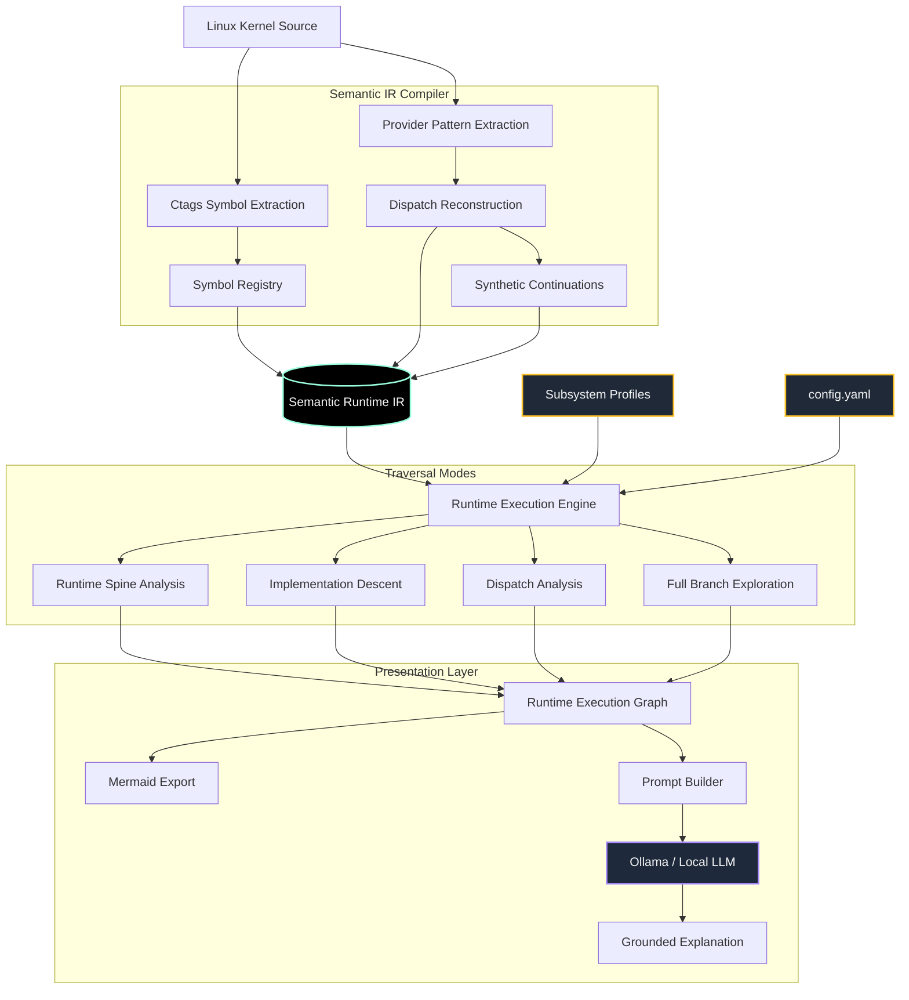

# KernelScope - New Avatar of Linux Flow Explorer
### Semantic Runtime Reconstruction for the Linux Kernel

⚡ Runs fully locally. No API keys. No cloud dependency. No usage cost.

KernelScope reconstructs Linux kernel runtime behavior using:
- semantic IR generation
- dispatch-aware runtime reconstruction
- subsystem semantic profiles
- runtime graph traversal
- local LLM interpretation

Instead of relying on an LLM’s internal knowledge alone, KernelScope builds semantic execution structure directly from Linux kernel source code.

---

# The Core Idea

Traditional AI-assisted kernel exploration often looks like:

```text
Question → LLM → Explanation
```

KernelScope instead does:

```text
Question
↓
Semantic IR reconstruction
↓
Runtime execution synthesis
↓
Dispatch reconstruction
↓
Runtime graph generation
↓
LLM interpretation constrained by runtime evidence
```

The runtime graph becomes the primary source of truth.

---

# Example Runtime Reconstruction

Query:

```text
1-Explain the Linux scheduler
```

Runtime reconstruction:

```text
schedule()
→ __schedule_loop()
→ __schedule()
→ pick_next_task()
→ __pick_next_task()
→ pick_next_task_fair()
→ context_switch()
→ __switch_to()
→ finish_task_switch()
```

KernelScope reconstructs scheduler-class dispatch behavior:

```text
sched_class.pick_next_task
    → pick_next_task_fair()
```

rather than relying purely on static direct-call analysis.

---

# Why This Project Exists

The Linux kernel is:
- massive
- highly modular
- full of indirect dispatch
- deeply subsystem-oriented
- execution-context sensitive

Large language models can explain Linux concepts, but often:
- hallucinate execution flow
- simplify dispatch behavior
- omit runtime transitions
- lose subsystem boundaries

KernelScope addresses this using:
- semantic runtime reconstruction
- execution-aware traversal
- dispatch-aware semantic graphs
- runtime-constrained prompting

---

# Current Capabilities

Implemented:
- ctags-based symbol extraction
- semantic graph generation
- runtime execution reconstruction
- scheduler dispatch reconstruction
- traversal-mode runtime synthesis
- Mermaid runtime graph export
- persistent semantic IR bundle caching
- subsystem semantic profiles
- runtime-constrained LLM prompting
- MM subsystem traversal
- VFS subsystem traversal

Current scheduler dispatch reconstruction:

```text
pick_next_task()
→ __pick_next_task()
→ pick_next_task_fair()
```

Synthetic runtime continuations:

```text
pick_next_task_fair()
→ context_switch()
→ __switch_to()
→ finish_task_switch()
```

---

# Traversal Modes

KernelScope supports multiple semantic traversal strategies.

## 1 - Runtime Spine Analysis
Follow dominant subsystem runtime continuation flow.

Example:
```text
schedule()
→ pick_next_task()
→ context_switch()
→ __switch_to()
```

---

## 2 - Implementation Descent
Dive into low-level implementation internals.

Example:
```text
pick_next_task_fair()
→ dequeue_task()
→ rb_erase()
→ ____rb_erase_color()
```

---

## 3 - Dispatch Analysis
Explore runtime function-pointer dispatch behavior.

Example:
```text
sched_class.pick_next_task
→ pick_next_task_fair()
```

---

## 4 - Full Branch Exploration
Enumerate semantic execution branches across subsystem flows.

---

# Architecture

```text
Linux Kernel Source
↓
ctags Symbol Extraction
↓
Semantic IR Generation
↓
Semantic Graph Construction
↓
Dispatch Reconstruction
↓
Runtime Graph Synthesis
↓
Traversal-Mode Reconstruction
↓
Mermaid Runtime Graph Export
↓
Runtime-Constrained LLM Interpretation
```
---


# High-Level Design Diagram (Mermaid)

Here is a clean architectural map detailing the data flow from raw source code down to the presentation layer.


---

# Current Architecture Milestone

```text
✓ Semantic IR generation
✓ Provider-based dispatch reconstruction
✓ Synthetic continuation framework
✓ Scheduler profile
✓ VFS profile
✓ MM profile
✓ IRQ profile
✓ Block profile
✓ Workqueue submission profile
✓ Mermaid export
✓ Ollama integration
✓ YAML configuration layer
```

---

# Semantic Runtime IR

KernelScope compiles Linux kernel semantics into a persistent semantic IR bundle.

The semantic IR currently contains:
- symbols
- semantic edges
- dispatch relationships
- synthetic continuations
- subsystem semantic metadata
- traversal semantics

Current semantic edge ontology includes:
- DIRECT_CALL
- FUNCTION_POINTER_DISPATCH
- SYNTHETIC_CONTINUATION
- ASYNC_WAKEUP
- INTERRUPT_ENTRY
- INTERRUPT_EXIT
- STATE_MUTATION
- LOCK_ACQUIRE
- LOCK_RELEASE

---

# Runtime Graph Example

Generated Mermaid graphs visualize reconstructed runtime behavior.

Example:

```text
schedule
→ __schedule
→ pick_next_task
→ pick_next_task_fair
→ context_switch
→ __switch_to
```

Generated graphs are exported into:

```text
exports/
callgraphs/
```

---

# How It Works

KernelScope currently combines:
- semantic graph synthesis
- heuristic runtime reconstruction
- subsystem-aware traversal
- dispatch reconstruction
- semantic reranking
- local LLM interpretation

The system is evolving toward:
- semantic runtime summaries
- subsystem semantic explorers
- dispatch-aware execution modeling
- execution-phase reasoning

---

# Quick Start

```bash
python linux_code_assistant.py
```

You will see:

```text
Create your query with one prefix:

1 - Runtime Spine Analysis (Default)
2 - Implementation Descent
3 - Dispatch Analysis
4 - Full Branch Exploration
```

Example:

```text
1-Explain the Linux scheduler
```

---

# Example Queries

```text
1-Explain the Linux scheduler
2-Explain how CFS removes a task
3-Explain scheduler dispatch behavior
1-Explain Linux interrupt wakeup flow
```

---

# Repository Structure

```text
profiles/
runtime_reconstruction/
semantic_runtime/
visualization/
semantic_cache/
config/
```

Key architecture layers:

- profiles/
    subsystem semantic configuration

- runtime_reconstruction/
    runtime traversal strategies

- semantic_runtime/
    semantic ontology and runtime graph infrastructure

- visualization/
    Mermaid export and graph rendering

- config/
    yaml config file, config loading script

---

# Who This Is For

### Linux Kernel Engineers
- reconstruct subsystem execution flow
- explore scheduler/runtime behavior
- inspect indirect dispatch

### Engineers Learning the Kernel
- understand runtime behavior visually
- follow execution flow incrementally
- bridge subsystem interactions

### Systems / AI Engineers
- study semantic IR reconstruction
- study execution-aware retrieval
- study runtime-constrained prompting

### Local-First AI Enthusiasts
- fully offline
- no API dependency
- inspectable reasoning pipeline

---

# Current Limitations

Current implementation still includes:
- heuristic traversal selection
- partial dispatch reconstruction
- incomplete async modeling
- limited subsystem coverage
- no runtime trace validation yet

Implementation descent can still expand deeply into helper internals.

---

# Sample traces

```text
schedule()
→ pick_next_task_fair()
→ context_switch()

handle_mm_fault()
→ vm_operations:fault
→ filemap_fault()

handle_irq_event()
→ irqaction:handler

submit_bio()
→ blk_mq_submit_bio()
```
---

# Planned Work

## Runtime Reconstruction
- runtime spine prioritization
- execution continuation scoring
- wakeup-flow reconstruction
- IRQ execution reconstruction

## Semantic Runtime Modeling
- semantic runtime summaries
- state transition reasoning
- execution-phase modeling
- lock/state annotations
- async execution semantics

## Dispatch Reconstruction
- provider-pattern generalization
- expanded function-pointer reconstruction
- subsystem-specific dispatch semantics

## Visualization
- dispatch-aware Mermaid graphs
- subsystem boundary visualization
- execution-phase overlays

## Intelligence Layer
- runtime-conditioned prompting
- semantic runtime summarization
- reduced raw-code dependency
- execution-aware explanation shaping

---

# Long-Term Direction

KernelScope is evolving toward:

```text
Semantic Runtime IR Exploration
```

rather than:
```text
generic code retrieval + chatbot interaction
```

The long-term goal is to turn large complex systems into:
- explorable semantic runtime models
- inspectable execution graphs
- explainable subsystem behavior

The same architecture can eventually extend beyond the Linux kernel into:
- distributed systems
- embedded firmware
- operating systems
- large-scale software platforms

---

# License

This project is licensed under the MIT License.

Note:
KernelScope indexes and analyzes Linux kernel source code,
which is licensed under GPLv2.

This repository does not redistribute the Linux kernel source itself.